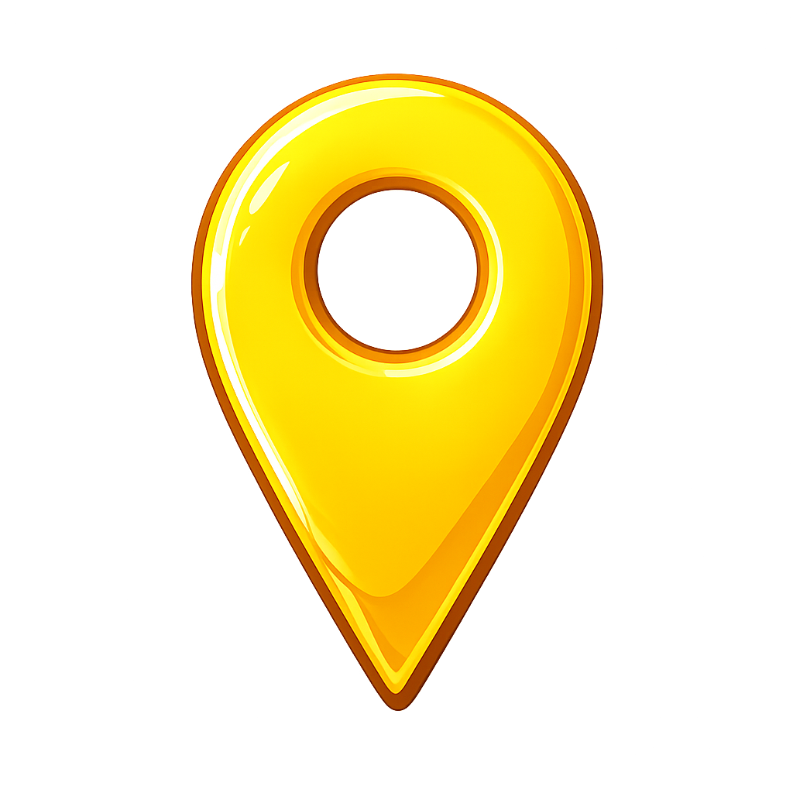

  
  
  

  
  

  

> Sistema web para cadastro e busca de itens perdidos utilizando o Flask.

## ✨ Funcionalidades
- Cadastro de itens
- Edição de itens
- Remoção de itens
- Feed de itens
- Sistema de login de usuário
- Sistema cadastro de usuário

## 🚀 Execução
### Clone o repositório:
git clone https://github.com/Bruno-Anjos01/achados-e-perdidos.git
